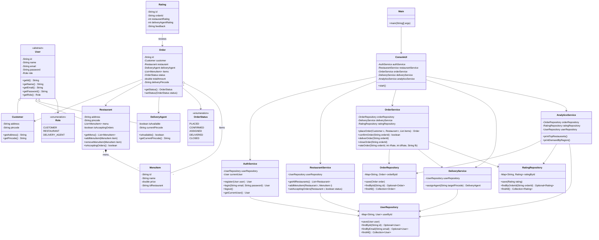

```mermaid
classDiagram
    %% Enumerations
    class Role {
        <<enumeration>>
        CUSTOMER
        RESTAURANT
        DELIVERY_AGENT
    }

    class OrderStatus {
        <<enumeration>>
        PLACED
        CONFIRMED
        ASSIGNED
        DELIVERED
        CLOSED
    }

    %% Models
    class User {
        <<abstract>>
        -String id
        -String name
        -String email
        -String password
        -Role role
        +getId() String
        +getName() String
        +getEmail() String
        +getPassword() String
        +getRole() Role
    }

    class Customer {
        -String address
        -String pincode
        +getAddress() String
        +getPincode() String
    }

    class Restaurant {
        -String address
        -String pincode
        -List~MenuItem~ menu
        -boolean isAcceptingOrders
        +getMenu() List~MenuItem~
        +addMenuItem(MenuItem item)
        +removeMenuItem(MenuItem item)
        +isAcceptingOrders() boolean
    }

    class DeliveryAgent {
        -boolean isAvailable
        -String currentPincode
        +isAvailable() boolean
        +getCurrentPincode() String
    }

    class MenuItem {
        -String id
        -String name
        -double price
        -String idRestaurant
    }

    class Order {
        -String id
        -Customer customer
        -Restaurant restaurant
        -DeliveryAgent deliveryAgent
        -List~MenuItem~ items
        -OrderStatus status
        -double totalAmount
        -String deliveryPincode
        +getStatus() OrderStatus
        +setStatus(OrderStatus status)
    }

    class Rating {
        -String id
        -String orderId
        -int restaurantRating
        -int deliveryAgentRating
        -String feedback
    }

    %% Model Relationships
    User <|-- Customer
    User <|-- Restaurant
    User <|-- DeliveryAgent
    User --> Role
    Restaurant "1" *-- "*" MenuItem : menu
    Order --> Customer
    Order --> Restaurant
    Order --> DeliveryAgent
    Order --> OrderStatus
    Order "1" o-- "*" MenuItem : items
    Rating --> Order : reviews

    %% Repositories
    class UserRepository {
        -Map~String, User~ userById
        +save(User user)
        +findById(String id) Optional~User~
        +findByEmail(String email) Optional~User~
        +findAll() Collection~User~
    }

    class OrderRepository {
        -Map~String, Order~ orderById
        +save(Order order)
        +findById(String id) Optional~Order~
        +findAll() Collection~Order~
    }

    class RatingRepository {
        -Map~String, Rating~ ratingById
        +save(Rating rating)
        +findByOrderId(String orderId) Optional~Rating~
        +findAll() Collection~Rating~
    }

    %% Services
    class AuthService {
        -UserRepository userRepository
        -User currentUser
        +register(User user) User
        +login(String email, String password) User
        +logout()
        +getCurrentUser() User
    }

    class RestaurantService {
        -UserRepository userRepository
        +getAllRestaurants() List~Restaurant~
        +addMenuItem(Restaurant r, MenuItem i)
        +setAcceptingOrders(Restaurant r, boolean status)
    }

    class DeliveryService {
        -UserRepository userRepository
        +assignAgent(String targetPincode) DeliveryAgent
    }

    class OrderService {
        -OrderRepository orderRepository
        -DeliveryService deliveryService
        -RatingRepository ratingRepository
        +placeOrder(Customer c, Restaurant r, List items) Order
        +confirmOrder(String orderId) boolean
        +deliverOrder(String orderId)
        +closeOrder(String orderId)
        +rateOrder(String orderId, int rRate, int dRate, String fb)
    }

    class AnalyticsService {
        -OrderRepository orderRepository
        -RatingRepository ratingRepository
        -UserRepository userRepository
        +printTopRestaurants()
        +printDemandByRegion()
    }

    %% Service Dependencies
    AuthService --> UserRepository
    RestaurantService --> UserRepository
    DeliveryService --> UserRepository
    OrderService --> OrderRepository
    OrderService --> DeliveryService
    OrderService --> RatingRepository
    AnalyticsService --> OrderRepository
    AnalyticsService --> RatingRepository
    AnalyticsService --> UserRepository

    %% UI and Main
    class ConsoleUI {
        -AuthService authService
        -RestaurantService restaurantService
        -OrderService orderService
        -DeliveryService deliveryService
        -AnalyticsService analyticsService
        +start()
    }
    
    class Main {
        +main(String[] args)
    }

    ConsoleUI --> AuthService
    ConsoleUI --> RestaurantService
    ConsoleUI --> OrderService
    ConsoleUI --> DeliveryService
    ConsoleUI --> AnalyticsService
    Main --> ConsoleUI
```